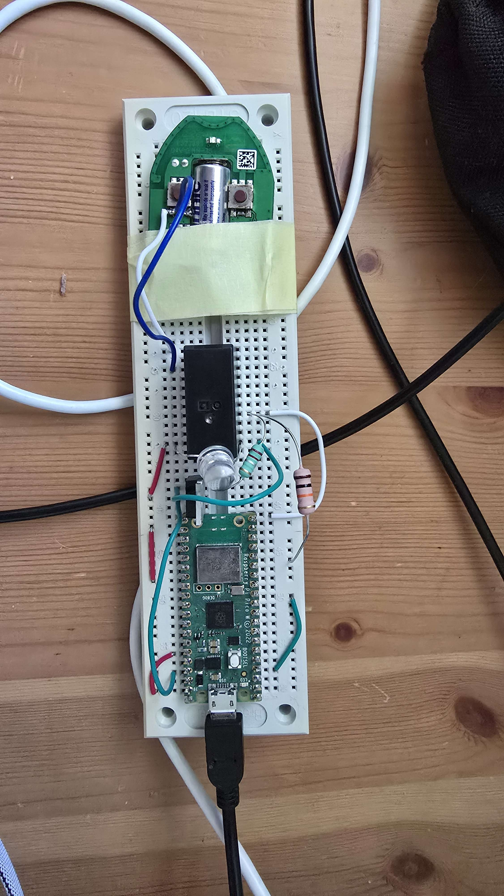

<!-- omit in toc -->
# WLAN Gate Opener

This is a personal project with the goal of opening a gate from the phone.

- [Components](#components)
- [Setup](#setup)
  - [Setup IDE](#setup-ide)
  - [Setup MicroPython](#setup-micropython)
  - [Setup Project on Pico](#setup-project-on-pico)
- [Circuit](#circuit)
  - [Circuit Diagram](#circuit-diagram)
  - [Pico W pinouts](#pico-w-pinouts)
- [How the final result looks like in real life](#how-the-final-result-looks-like-in-real-life)

## Components

- MOSFET -- [IRLI540NPbF](https://www.infineon.com/dgdl/irli540npbf.pdf?fileId=5546d462533600a401535664018125c1)
- Relay -- [LMR2-3D](https://www.tme.eu/Document/cb95bab3047ea17130b1da862f2b7351/LMR-series.pdf)
   > Most likely not needed -- MOSFET can be used instead but I like the audio feedback it gives.
   >
   >Only one side is used so LMR1 is totally fine, this was just locally available.
- Microcontroller -- [Pico W](https://www.raspberrypi.com/documentation/microcontrollers/pico-series.html#pico-1-family)
- Resistors:
  - 220 Ω
  - 10 kΩ
- Remote that opens the gate (mine operates on a 12V battery)

## Setup

### Setup IDE

I decided to use [Visual Studio Code](https://code.visualstudio.com/) to develop this project but [Thonny](https://thonny.org/) is a good alternative.

- install [Visual Studio Code](https://code.visualstudio.com/)
- install reccomended extensions, can be found in [.vscode\extensions.json](.vscode\extensions.json)
  - the most important one is the [MicroPico](https://marketplace.visualstudio.com/items?itemName=paulober.pico-w-go) extension

> More information can be found in paragraph 4.2 of [Raspberry Pi Pico-series Python SDK](https://datasheets.raspberrypi.com/pico/raspberry-pi-pico-python-sdk.pdf)

### Setup MicroPython

Setup [MicroPython](https://docs.micropython.org/en/latest/) on raspberry pi Pico

- download MicroPython (version used is v1.25.0)
  - the latest from <https://micropython.org/download/rp2-pico-w/rp2-pico-w-latest.uf2>
  - or use the one I used for this project [dev\RPI_PICO_W-20250415-v1.25.0.uf2](dev\RPI_PICO_W-20250415-v1.25.0.uf2)
- program the Pico
  1. Push and hold the BOOTSEL button while connecting your Pico with a USB cable to a computer. Release the BOOTSEL button once your Pico appears as a Mass Storage Device called RPI-RP2.
  2. Drag and drop the MicroPython UF2 file onto the RPI-RP2 volume. Your Pico will reboot. You are now running MicroPython.
  3. Access the REPL via USB Serial.

> More information can be found on [Drag-and-Drop MicroPython -- Raspberry Pi Documentation](https://www.raspberrypi.com/documentation/microcontrollers/micropython.html#drag-and-drop-micropython)

### Setup Project on Pico

Get the project running on pico

- copy `env.py.example` to `src\env.py`
  - on windows use `cp .\env.py.example .\src\env.py`
- populate required fields with information
  - `SSID` with the name of the Wi-Fi you want to connect to
  - `WLAN_PASS` with the password for that connection
  - `SIGNAL_DURATION` with how long you want the remote to be on in milliseconds
- upload project to Pico
  - open command palette (`F1` or `Ctrl+Shift+P`) in vscode
  - then `MicroPico: Upload project to Pico`
  - alternative is to use [rshell](https://github.com/dhylands/rshell)

MicroPython automatically starts `main.py` on device start.
> see more -- [MicroPython - Reset and Boot Sequence](https://docs.micropython.org/en/latest/reference/reset_boot.html#main-py)

## Circuit

### Circuit Diagram

*Picture of the circuit that is used in this project*

### Pico W pinouts

Pinouts used in this project:

- `3V3(OUT)` (36) -- powering the relay MOSFET circuit
- `GND` (38) -- final point of the relay MOSFET circuit
- `GP15` (20) -- driving the MOSFET's gate
- `GND` (3) -- final point of the circuit that controls the MOSFET

*Pico W pinouts, source -- <https://www.raspberrypi.com/documentation/microcontrollers/images/picow-pinout.svg>*

## How the final result looks like in real life

